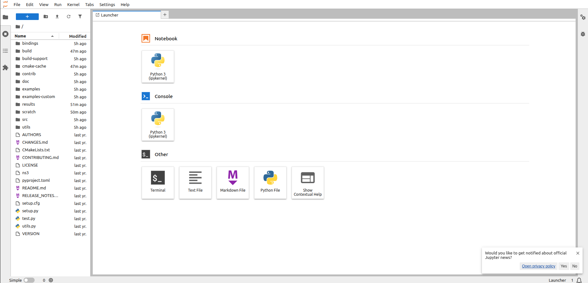

# 🐳 NS-3.42 Docker - Network Simulator Container

**Complete Docker solution for NS-3 (Network Simulator 3)** featuring pre-built images, easy-to-use wrapper scripts, batch processing, and a full development environment with Jupyter Lab.

[](https://hub.docker.com/r/huakson/ns3-simulator)
[](https://www.nsnam.org/)
[](https://alpinelinux.org/)
[](https://hub.docker.com/r/huakson/ns3-simulator/tags)

---

## 🌟 Key Features

- ✅ **Pre-built Images**: Get started in seconds, not 30 minutes of compilation.
- ✅ **3 Operation Modes**: Runtime (CLI), Batch (Python), and Dev (Jupyter).
- ✅ **Volume Mapping**: Automatic sync for `scratch/` scripts and `results/` data.
- ✅ **Development Ready**: Includes `gdb`, `valgrind`, and `cmake` tools.
- ✅ **Smart Wrappers**: Scripts that handle binary execution transparently.

---

## 🏗️ Architecture Support

| Architecture | Support Status | Action Required |
| :--- | :--- | :--- |
| **Intel/AMD (amd64)** | ✅ **Native** | Just pull and run. Pre-built on Docker Hub. |
| **Apple M1/M2 / ARM** | ⚠️ **Manual Build** | Requires building locally (see instructions below). |

> **Note for Mac M1/M2 Users:** The pre-built image is `amd64`. It runs via Rosetta emulation (slower). For native speed, use `./scripts/buildx-push --runtime --arm64-only` to build your own image.

---

## 🚀 Quick Start

### 1. Initialize
This command pulls the image and sets up the environment.

```bash
make init
```

### 2. Run a Simulation
Run the included example directly:

```bash
./scripts/ns3 run wifi-simple
```

Or run your own code by placing `.cc` files in the `scratch/` folder:

```bash
# Example: If you have scratch/my-sim.cc
./scripts/ns3 run my-sim
```

---

## 🎯 Usage Modes

### Mode 1: Runtime (CLI)
Lightweight mode for running simulations and getting results. Uses the `runtime` image (~500MB).

```bash
# Syntax
./scripts/ns3 run <simulation-name> [args]

# Example with arguments
./scripts/ns3 run "wifi-simple --distance=100 --time=20"
```

### Mode 2: Batch Processing
Perfect for parameter sweeps. Writes Python scripts in `scratch/` that execute multiple simulations.

1. Create a python script in `scratch/` (e.g., `batch-experiment.py`).
2. Run it using the batch wrapper:

```bash
make batch CMD="python3 scratch/batch-experiment.py"
```

*Results are automatically saved to `results/`.*

### Mode 3: Development Environment (Jupyter Lab)
Full environment with **Jupyter Lab**, **C++ tools**, and **Python bindings**. Perfect for data analysis and debugging.

**Start the environment:**
```bash
docker compose --profile dev up -d ns3-dev
```

**Access Jupyter:**
1. Check the logs to get the access token:
   ```bash
   docker compose logs ns3-dev | grep "http://127.0.0.1:8888"
   ```
2. Open the URL in your browser.

<br>
<p align="center">
  
</p>
<br>

**Stop the environment:**
```bash
make down
```

---

## 📁 Project Structure

```
ns3-docker/
├── scratch/              # 📝 PUT YOUR CODE HERE (.cc files)
├── results/              # 📊 OUTPUTS (CSV, logs, traces)
├── scripts/              # 🔧 Wrapper scripts (ns3, ns3-build, etc)
├── examples/             # 📚 Reference examples
├── Dockerfile            # Multi-stage definition
├── docker-compose.yml    # Service orchestration
└── public/               # Assets for README
```

---

## 🛠️ Advanced Commands

| Command | Description |
| :--- | :--- |
| `make ns3-build` | Re-compiles all scripts in `scratch/` |
| `make shell` | Opens a bash shell inside the container |
| `make clean-all` | Cleans build artifacts and removes containers |
| `make rebuild` | Forces a rebuild of the Docker image locally |

---

## 🤝 Contributing & Building

If you want to modify the Docker image or build for ARM64:

```bash
# Build locally
make build

# Push to your own Docker Hub (requires .env configuration)
make push-latest
```

---

## 📄 License

This project is licensed under MIT. NS-3 is licensed under GNU GPLv2.

**Maintained by:** [Huakson](https://github.com/Huakson)
**Docker Hub:** [`huakson/ns3-simulator`](https://hub.docker.com/r/huakson/ns3-simulator)
